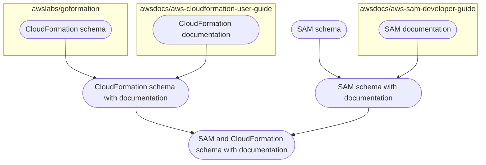

# AWS SAM JSON schema

## Context

The AWS SAM specification is spe

## Schema generation

At a high level, the final [`schema.json`](https://github.com/aws/serverless-application-model/blob/develop/samtranslator/schema/schema.json) is generated as such:

