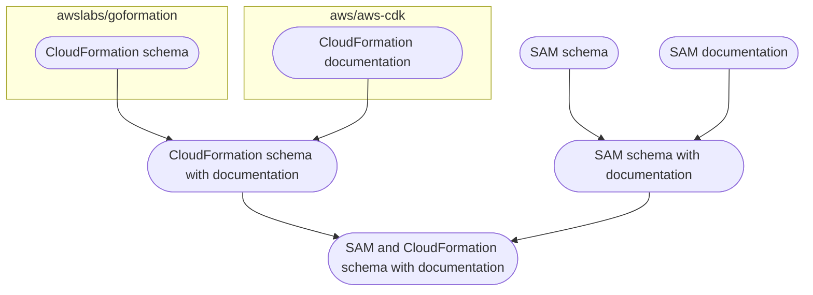

# AWS SAM JSON schema

## Context

The [AWS SAM specification](https://docs.aws.amazon.com/serverless-application-model/latest/developerguide/sam-specification.html) is defined by a [JSON schema](https://github.com/aws/serverless-application-model/discussions/2645).

## Schema generation

At a high level, the final [`schema.json`](https://github.com/aws/serverless-application-model/blob/develop/samtranslator/schema/schema.json) is generated as such:

The schema is [automatically updated](https://github.com/aws/serverless-application-model/blob/develop/.github/workflows/schema.yml) at regular intervals.
